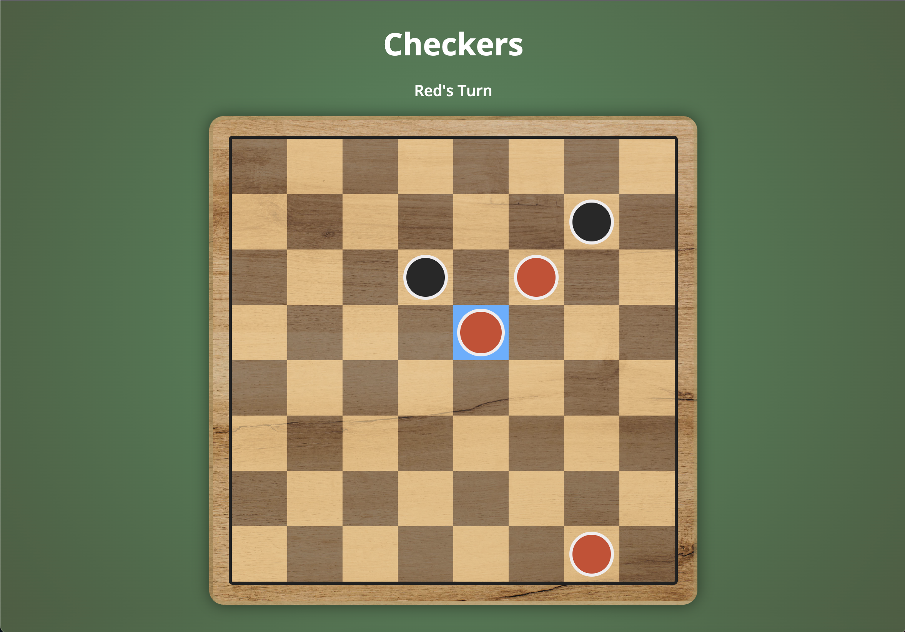

# Ian MacDonald – Checkers
=====

## Game Description
Welcome to my Checkers game, a digital rendition of the classic two-player strategy board game. Checkers is a game that combines simplicity and complexity, making it a timeless favorite for players of all ages.

The primary objective of Checkers is to strategically eliminate all of your opponent's pucks or trapping them in a position where they cannot make a legal move. Players take turns moving their pieces diagonally across the board. A player can eliminate an opponent's puck by jumping over them. 

Strategic thinking, planning ahead, and tactical execution are the keys to success. While the primary goal is eliminating your opponent's pucks, the path to victory takes various forms. Standard pucks can only move forward from their starting position, but when a standard puck reaches the row on the far side of the board, it becomes a King. A King has enhanced movement capability, allowing it to travel diagonally in any direction, giving the player a tremendous tactical advantage. 

Checkers is not just a game of wits; it's a contest of foresight and adaptability. Players must anticipate their opponent's moves while planning their own advances. The transition from standard pucks to Kings brings a new dimension to the game, allowing you to turn the tide when victory seems elusive. Whether you're a seasoned vet or new to the game, Checkers offers an engaging and intellectually stimulating experience that's perfect for both casual and competitive players. Get ready to engage in this age-old battle of wits on your digital board – it's your move!

*Check out the screenshots below to see how the game works!*

## Screenshots 
### Starting Position and Movable Pucks: 
This shows how the game should look at the start – Red always goes first. Depending on the player's turn, the movable pieces will be highlighted. 

### Legal Moves:
When a movable puck is clicked on, the spaces that puck has the capability of moving to will be highlighted in green. 

Clicking on those spaces moves the puck there. If there is no multi-jump opportunity, the player turn will change and the other player's movable pucks will be highlighted. 
*Multi-jumps will be demonstrated below.*

### Jumps:
Whenever a player is capable of jumping an opponent's piece, they are forced into making that move. Notice in the picture below how the red player is forced into performing the jump, and cannot move the piece in the bottom-right of the board. 

When a movable puck capable of jumping an opponent is clicked on, two spaces will highlight. The space(s) that the puck can be moved to will be highlighted green, and the puck(s) that will be eliminated will be highlighted red. 

Completing the jump removes the opponent's piece from the board.

### Multi-Jumps:
One of the key, punishing moves of Checkers is the multi-jump. If a puck is capable of jumping two or more of the opponent's pucks, the player will be prompted to continue jumping until all of the jumps are finished.  

Notice here, the player has two options to jump:

After completing the jump, the player continues, but can only continue with the puck they just used to jump. This will coninue until that puck has no more jumps to execute, and then the player turn will change.

### Getting Kinged:
When a player's puck reaches the opposite end of the board, it gets upgraded to a "king". This allows the puck the move in all directions, rather than just forward like normal pucks. There is also a visual update to the puck to identify it as a king more easily. 

Here, see a red puck and black puck earn "king" status by reaching the opposite end. 

Kings are capable of moving or jumping in any direciton, regardless of color.

### Winner:
When a player eliminates their opponent's final puck, or prevents them from making any legal moves, a winner message will be displayed. A play again button will reset the game to start over! 

## Technologies Used

## Challenging Code Parts 

## Next Steps 